# Lab1Web

<strong>Repository ini dibuat untuk memenuhi tugas Pemrograman Web</strong>
| <strong>Nama</strong>      | <strong>Riris Naomi Gurning</strong>  |
| ----------- | ----------- |
| <strong>NIM</strong>     | <strong>312010190</strong>       |
| <strong>Kelas</strong>   | <strong>TI.20.A.1</strong>        |

<i>HTML Dasar</i>

<strong>
<mark>LANGKAH - LANGKAH PRATIKUM</mark>
</strong>

1. # <strong>Membuka VSCode</strong>
<strong><i>Persiapan membuka VSCode dan Browser.</i></strong> 
    

2. # <strong>Kemudian membuat file baru dengan nama lab1_tag_dasar.html dan tambahkan tag dasar dokumen</strong>
<strong>HTML.</strong>
        
<i>dibawah ini tampilan dari VScode</i>

            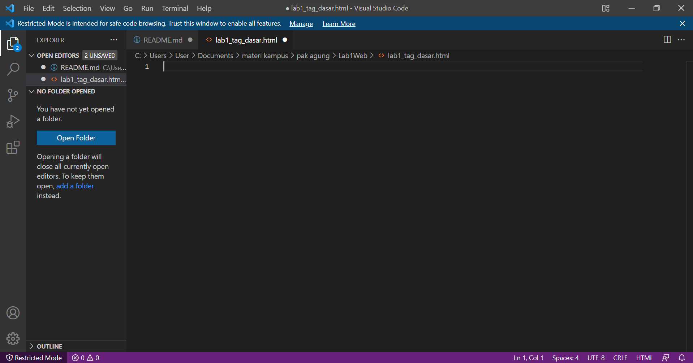
        
<i>dibawah ini tampilan dari File Explorer</i>
 
            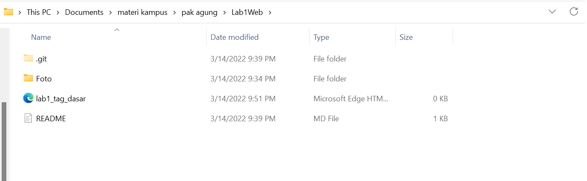

3. # <strong>Kemudian file lab1_tag_dasar.html di ketik html : 5</strong>
<strong><i>dibawah ini tampilan yang akan muncul di VSCode<i></strong>
           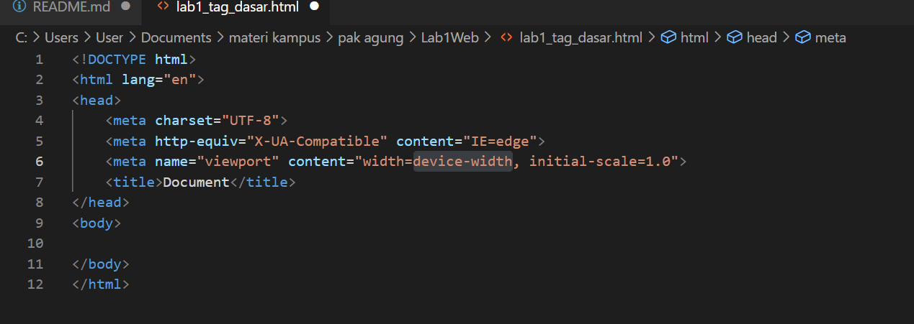
       * 
<i>Setelah itu buka file tersebut pada web browser misalnya Microsoft Edge.</i>

           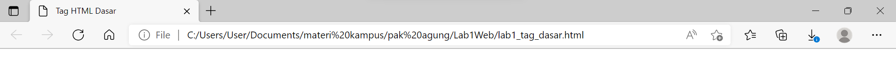

4. # <strong>Setelah membuat file lab1_tag_dasar.htlm, langkah selanjutnya sebagi berikut:</strong>
* <strong><i>Membuat Paragraf</i></strong>
   <strong> Langkah yang pertama ini membuat beberapa paragraf sederhana sebagai berikut: 
   <strong><ins>tampilan di VSCode<ins></strong>
      
   </strong><ins>tampilan di Microsoft Edge<ins></strong>
      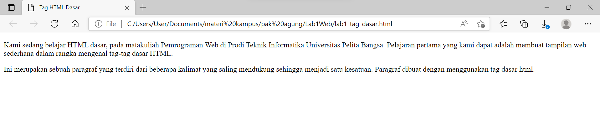
   </strong><i>Kemudian atur atribut paragraf seperti berikut <b>align</b>, dan amati perubahanya dibawah ini </i>
      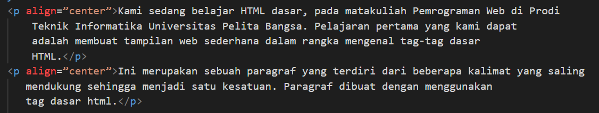
* <strong><i>Menambah Judul</i></strong>
   <strong> Seperti sudah dijelaskan pada materi bahwa judul memiliki 6 level yaitu mulai h1 sampai h6.Kemudian tambahkan judul h1 sebelum paragraf pertama dan tambahkan sub judul h2 sebelum paragraf kedua. </strong>
      <strong><i>Tampilan di VSCode</i>
        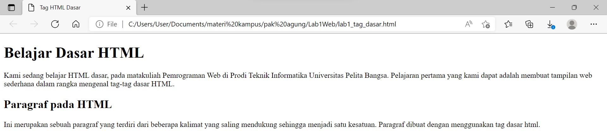
      <strong>Simpan perubahannya dan lihat hasilnya dengan melakukan refresh pada browser.</strong>
      <strong><i>Tampilan di Microsoft Edge</i> 
        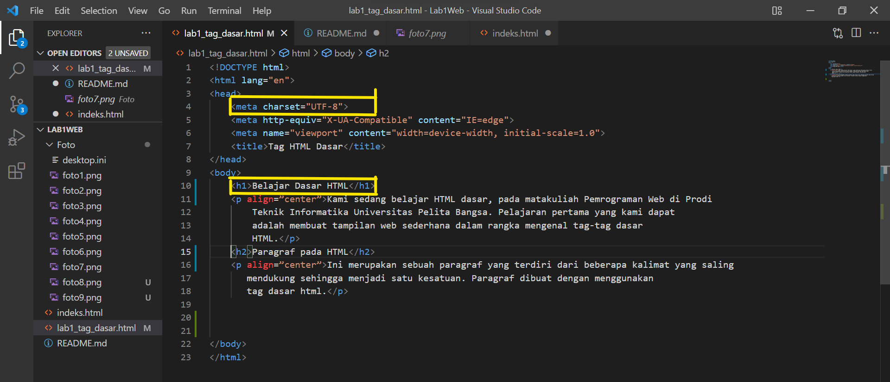
* <strong><i>Memformat Teks</i></strong>
    <strong> Lakukan pemformatan teks yang ada pada paragraf yang sudah ada sebelumnya, mengacu kepada penjelasan materi pemformatan teks, sehingga tampilannya seperti berikut. </strong>
    <strong><i>Tampilan di VSCode</i></strong>
        
    </strong><i>Tampilan di Microsoft Edge</i></strong>
        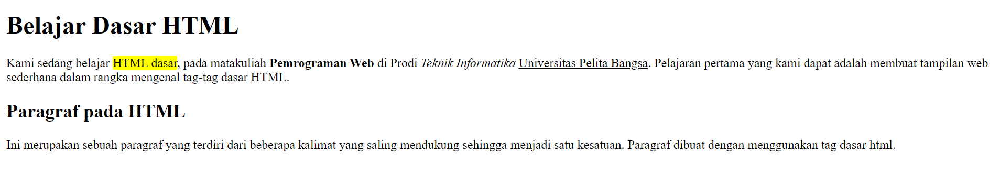
* <strong><i>Menyisipkan Gambar</i></strong>
    <strong> Untuk menyisipkan gmbar, siapkan gambar yang akan disisipkan pada halaman web, kemudian simpan file gambar tersebut satu folder dengan file dokumen html. Atau bisa juga menyisipkan gambar dari website external. </strong>
        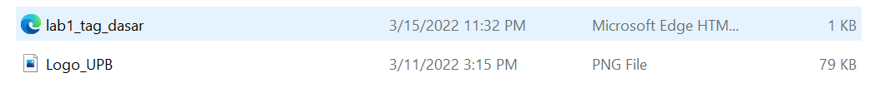
    <strong>Kemudian tambahkan tag img setelah paragraf yang kedua, dengan menambahkan heading 3 sebelumnya.

        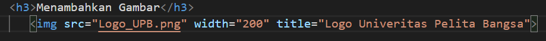
    </strong><i>Simpan perubahannya, kemudian refresh browser.<i></strong>

    </strong><i>Tampilan di Microsoft Edge</i></strong>
        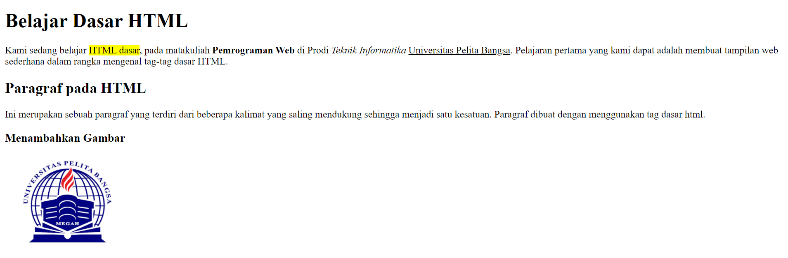
* <strong><i>Menambahkan Hyperlink</i></strong>
    <strong><i>Tambahkan hyperlink pada dokumen sebelum heading 1 seperti berikut.</i></strong>
        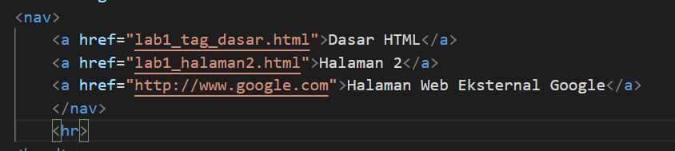

    <strong><i>Tampilan di Microsoft Edge</i></strong>
        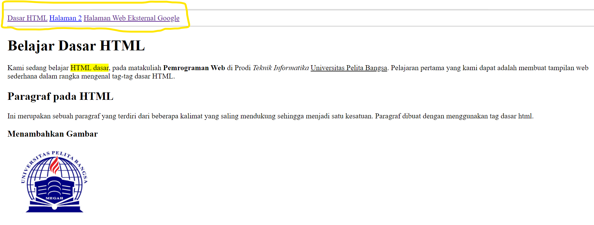

# *Jawab Pertanyaan Berikut*
1. Lakukan perubahan pada kode sesuai dengan keinginan anda, amati perubahannya adakah error ketika terjadi  kesalahan penulisan tag?
2. Apa perbedaan dari tag '< p >' dengan tag '< br >', berikan penjelasannya! 
3. Apa perbedaan atribut title dan alt pada tag '< img >', berikan penjelasannya!
4. Untuk mengatur ukuran gambar, digunakan atribut width dan height. Agar tampilan gambar proporsional sebaiknya kedua atribut tersebut diisi semua atau tidak? Berikan penjelasannya!
5. Pada link tambahkan atribut target dengan nilai atribut bervariasi ( _blank, _self, _top, _parent ), apa yang terjadi pada masing-masing nilai antribut tersebut?

# *Jawaban*
1. Saya melakukan perubahan pada tag html, gambar yang ada dibawah ini yaitu merupakan syntax HTML di VSCode sebelum saya merubahnya
 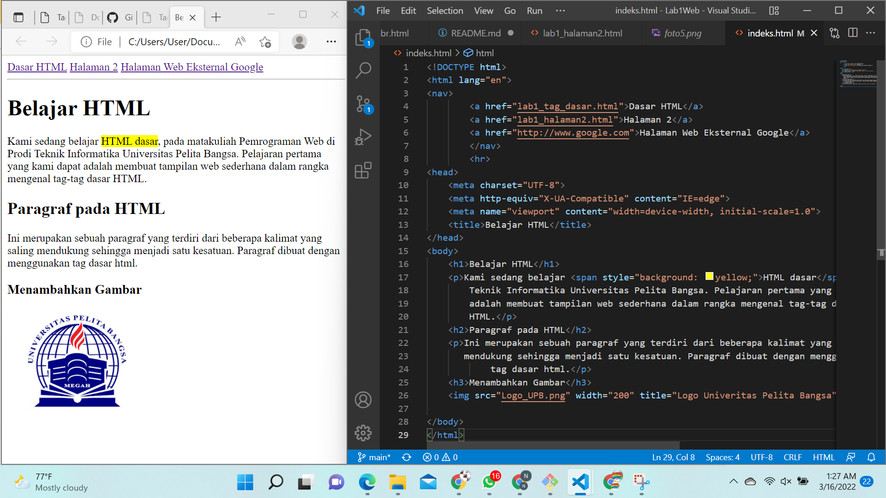
 Lalu ketika saya hilangkan akhiran pada Tag `</h1>`menjadi `<h1>`, maka yang akan terjadi seluruh elemen dibawah tag tersebut akan berubah mengikuti Tag `<h1>` dikarenakan tidak ada akhiran/penutup Tag tersebut. 

2. Tag `
` berfungsi untuk memberi perintah paragraf pada halaman html

	Tag ` ` berfungsi untuk memberikan perintah breakline atau baris baru

 

3. `title` berfungsi untuk memberikan judul pada gambar

	`alt` berfungsi untuk menunjukkan sebuah alternate text (teks pengganti) yang akan muncul apabila gambar tidak dapat ditampilkan.

	gambar dibawah ini menunjukan perbedaan title dan alt

 

4.Menurut saya Kedua property ini sangat penting dan merupakan bagian yang tidak terpisahkan dari sebuah website karena masing-masing Tag atau Element pada sebuah HTML perlu memiliki ukuran yang ideal, sebab itu berpengaruh dalam pengaturan tataletak dan tampilan sebuah website,

	Kecuali pada kondisi tertentu seperti gambar sudah memiliki ukuran yang pas/proporsional cukup mengatur width nya saja

   

5. `_blank` untuk membuka link di tab baru

	`_self` untuk membuka link di frame link itu berada

	`_top` untuk membuka link di frame paling atas (paling luar).  contohnya jika di website(1) di dalamnya ada website(2) lalu di website(2) di dalamnya ada website (3) lalu di website (3) ini ada link dan kita klik, maka link akan terbuka di website(1)

	`_parent` untuk membuka link di frame yang satu tingkat di atas frame link tersebut berada. contohnya jika di website(1) di dalamnya ada website(2) lalu di website(2) ini ada link dan kita klik, maka link akan terbuka di website(1)
    
     

